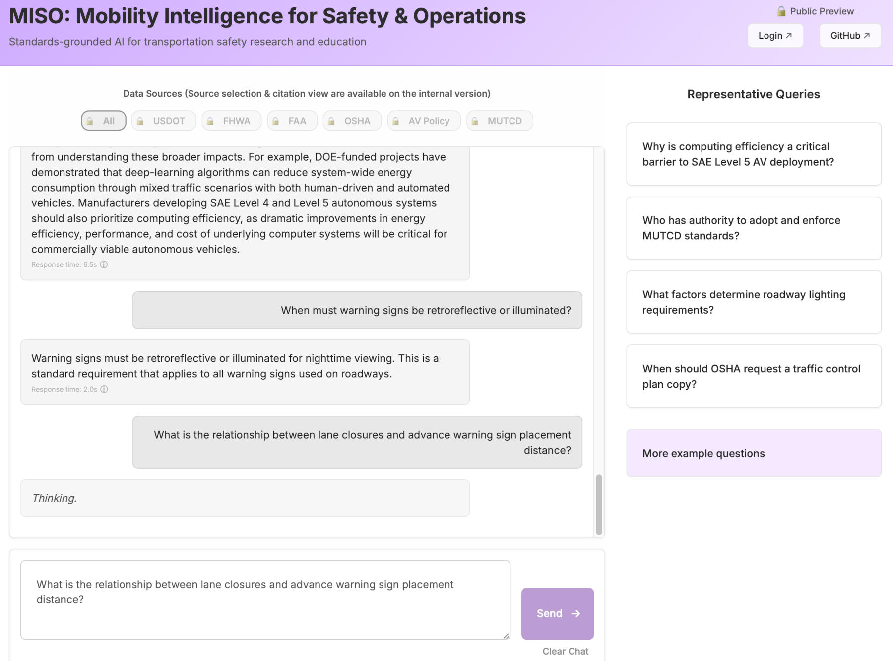
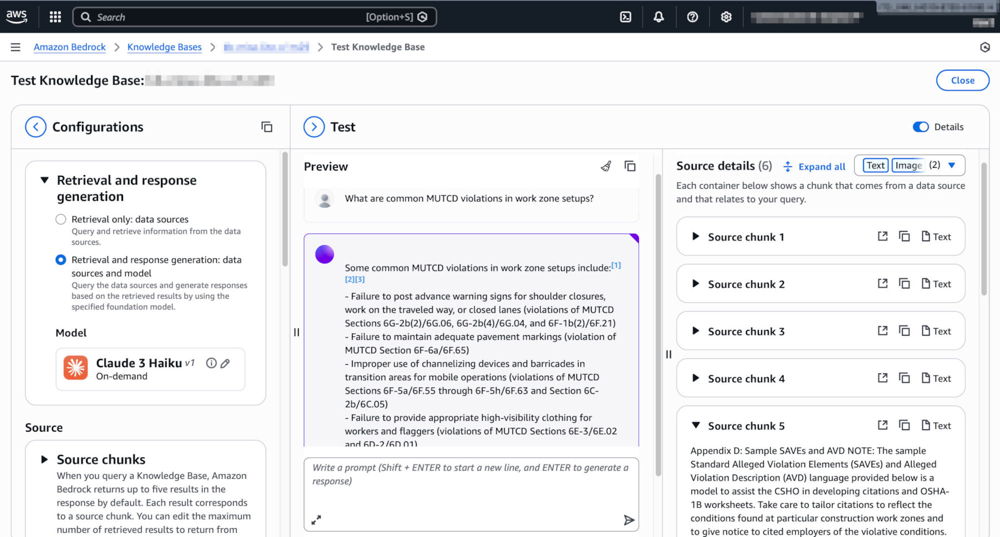

# MISO – Mobility Intelligence for Safety & Operations
<!--
**Website:** https://miso-mobility.info | 
-->
**URL:** http://miso-mobility.info | https://d34ct49ld973pt.cloudfront.net


MISO is a **standards-focused, retrieval-augmented intelligence platform** designed to support transportation engineering, traffic operations, safety analysis, and mobility research through **structured and explainable querying** of authoritative technical documents.

The platform operates over a curated knowledge base of **U.S. transportation, safety, and mobility standards**, drawing primarily from the U.S. Department of Transportation (USDOT) and its operating administrations (including FHWA and FAA), as well as workplace safety guidance from OSHA. Covered materials include highway safety regulations, traffic control standards, work zone operational rules, and policy frameworks relevant to Automated and Emerging Vehicle systems.

MISO prioritizes **depth, interpretability, and standards fidelity** over breadth, enabling rigorous use in civil engineering, Intelligent Transportation Systems (ITS), and safety-critical mobility research. The system is developed primarily for **internal research and prototyping** <!--within the UML ITS research group, with an emphasis on accuracy, traceability, and technical rigor rather than general-purpose conversational AI.-->




---

## Purpose & Motivation

Transportation and mobility domains rely heavily on large, complex, and often fragmented technical documents (e.g., MUTCD, FHWA guidance, AV policy frameworks). These documents:

- Are lengthy and difficult to search semantically  
- Require **precise citation of sections, figures, and clauses**  
- Demand conservative, standards-aligned interpretation  
- Are frequently used by engineers, planners, and researchers under time constraints  

MISO addresses these challenges by providing a **Retrieval-Augmented Generation (RAG)** interface that allows users to query authoritative documents while preserving **context, hierarchy, and source traceability**.

MISO is designed to **bridge policy language and engineering reasoning**, while preserving traceability back to source documents.

---

## Retrieval-Augmented Generation (RAG) Approach

MISO uses a **hierarchical RAG pipeline** optimized for technical and regulatory documents.

### Hierarchical Chunking Strategy

Instead of flat text chunking, documents are ingested using **structural hierarchy**, such as:

- Manual → Part → Chapter → Section → Subsection → Paragraph
- Tables and figures linked to their parent sections
- Metadata tags for document name, edition, and scope

**Advantages:**
- Preserves regulatory intent and context  
- Reduces hallucination in standards interpretation  
- Enables precise citation and trace-back  
- Improves retrieval quality for clause-specific queries  





---

## Architecture Overview (AWS)

MISO is implemented using a **serverless AWS architecture**, optimized for scalability, cost efficiency, and rapid prototyping.

### High-Level Architecture

```
User (Web UI)
↓
CloudFront
↓
S3
↓
API Gateway
↓
AWS Lambda
↓
Amazon Bedrock Knowledge Base
```


### Core Services

- **Amazon S3**  
  Hosts static assets for the application and documentation.  
  Also used for storing raw records and ingested source files.

- **Amazon CloudFront**  
  Provides secure, low-latency global content delivery for frontend assets and documentation.

- **Amazon API Gateway**  
  Acts as the public-facing API layer, routing requests from the frontend to backend services.  
  Enables authentication, throttling, and versioned APIs.

- **AWS Lambda**  
  Handles request orchestration, query preprocessing, and response formatting.  
  Serves as the primary compute layer for lightweight, event-driven workloads.

- **Amazon Bedrock Knowledge Base**  
  - Stores vectorized representations of ingested manuals and reference documents  
  - Performs semantic retrieval using embeddings  
  - Supplies grounded context to foundation models for response generation  

- **Amazon DynamoDB**  
  - Stores actress records and structured metadata  
  - Manages user access control, permissions  
  - Provides low-latency, scalable NoSQL storage

### Observability & Monitoring

- **Amazon CloudWatch (Logs & Metrics)**  
  Centralized logging for Lambda, API Gateway, and other AWS services.  
  Enables metrics, alarms, and operational dashboards.

---

### Key Benefits

- Modular expansion of document and data sets  
- Fine-grained access control and future guardrails  
- Low operational overhead for research and experimental deployments  
- Built-in observability for debugging, monitoring, and performance tuning

---

## Ingested Document Families (High-Level)

| Document Family | Domain | Type of Knowledge | Relevance to MISO |
|-----------------|--------|------------------|------------------|
| USDOT Automated Vehicle Policy | Automated & Connected Vehicles | Federal policy guidance | Supports AV governance analysis, deployment frameworks, and policy-aligned system design |
| FAA Small UAS Regulations | Aviation / UAS | Federal regulation (CFR) | Enables precise interpretation of operational constraints, safety requirements, and airspace compliance |
| FAA UAS Advisory Circulars | Aviation / UAS | Interpretive & operational guidance | Provides explanatory context beyond regulatory text, critical for applied research and compliance-aware systems |
| FHWA Work Zone Safety & Mobility | Highway Safety | Federal rule and guidance | Core to work zone planning, safety modeling, TMP development, and traffic operations research |
| FHWA Work Zone FAQs | Highway Safety | Interpretive guidance | Captures agency intent and real-world interpretation of regulatory language |
| FHWA Road Safety Audit Guidance | Roadway Safety | Engineering guidelines | Supports safety evaluation workflows and evidence-based safety assessment |
| FHWA Lighting Guidance | Traffic Engineering | Technical handbook | Relevant for visibility, nighttime safety, and infrastructure design decisions |
| FHWA Work Zone Safety Action Plans | Operations & Safety | Strategic guidance | Connects policy objectives with actionable safety interventions |
| FHWA Pavement Marking Rules | Traffic Control Devices | Federal rule | Critical for visibility, compliance, and safety performance evaluation |
| OSHA Roadway Work Zone Guidance | Worker Safety | Compliance and enforcement guidance | Integrates occupational safety considerations into transportation operations |
| MUTCD (All Parts, FAQs, Appendices) | Traffic Control Devices | National standard | Foundational reference for signs, markings, signals, and traffic control practices |

---

> Note: Document inclusion is curated to avoid legal, licensing, or copyright conflicts and is intended for **research and reference use only**.


## Role of MUTCD Within MISO

The MUTCD serves as the **structural anchor** of the system for roadway-related queries. Its hierarchical organization (Parts → Chapters → Sections → Standards / Guidance / Options) makes it particularly well-suited for:

- Hierarchical chunking and retrieval  
- Clause-level reasoning  
- Cross-referencing with FHWA rules, FAQs, and OSHA guidance  

<!--MISO preserves this hierarchy explicitly to avoid flattening regulatory intent.-->

---

## Research & Industry Impact

By combining **policy documents, regulations, guidance, and interpretive material** in a single retrieval framework, MISO enables:

- Standards-aware AI assistants for civil and transportation engineers  
- Faster literature and standards review for researchers  
- Reduced ambiguity in regulatory interpretation  
- Safer deployment of AI systems in transportation and mobility contexts  

This approach is especially relevant for:
- ITS and AV research  
- Work zone automation and monitoring  
- UAV integration in transportation and inspection workflows  
- Safety-critical decision support systems  

---

## Public vs Internal Deployment Models

MISO is deployed in **two tiers**:

### Public Web Version
- Optimized for **responsiveness**
- Uses a **smaller, faster foundation model**
- Enforced limits on:
  - Output length
  - Token / context size
- Intended for:
  - Demonstration
  - High-level standards queries
  - Educational and exploratory use

### Internal Research Version (UML ITS)
- Uses a **larger, higher-capacity model**
- Supports:
  - Longer reasoning chains
  - Deeper cross-document synthesis
  - Extended citations and contextual grounding


> **UML ITS lab members:**  
> If you are part of the lab, please contact me to set up an internal account.  
> Internal access will be available on the **Eduroam** network.

---

## Design Philosophy

MISO is not a generic chatbot. It is a **standards-grounded intelligence system**, built with the assumption that:

- Precision matters more than fluency  
- Traceability matters more than verbosity  
- Engineering judgment must be supported, not replaced  


## Status

- Prototype / research-stage system
- Active development and iteration
- Document coverage and guardrails evolving

---

## License & Disclaimer

This repository is intended for research and educational use.  
All referenced standards and manuals remain the property of their respective issuing authorities.

---

**MISO — Turning transportation standards into accessible, structured intelligence.**
